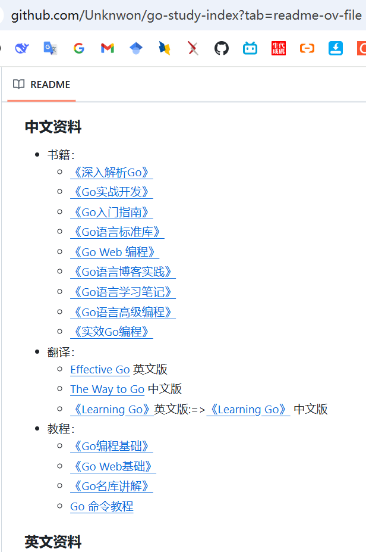

# go
go语言开发学习

https://www.yuque.com/aceld/mo95lb/dsk886#uF2gj

Go语言官网(需要翻墙)：https://golang.org/、https://tour.go-zh.org/welcome/1、https://pkg.go.dev/、https://pkg.go.dev/std、、
go中文社区：https://studygolang.com、https://studygolang.com/pkgdoc 、https://learnku.com/go/wikis/38122 、
学习资料：https://denganliang.github.io/the-way-to-go_ZH_CN/directory.html、https://github.com/gocn/knowledge、https://github.com/Unknwon/go-study-index、https://learnku.com/docs/the-way-to-go

https://gobyexample-cn.github.io/

[go中文在线文档](https://studygolang.com/pkgdoc)

https://word.topgoer.com/

https://www.bookstack.cn/read/golang_development_notes/zh-preface.md
https://github.com/guyan0319/golang_development_notes/blob/master/zh/preface.md

[go开发学习路线](https://github.com/darius-khll/golang-developer-roadmap.git)
go开发学习路线看 go-path.png

[//]: # (![go-path.png]&#40;go-path.png&#41;)

go的一些规范：
- [go命名规范](https://go.dev/talks/2014/names.slide)
- 
- 

# 学习资源

[Go开发模式 go-patterns](https://github.com/tmrts/go-patterns.git)

## 社区

[go学习重要社区，里面有很多东西](https://topgoer.com/)

[go语言中文文档](https://www.topgoer.cn/docs/golang/golang-1ccjbpfstsfi1)

[golang全栈指南 - - - - - 牛逼的网站](https://golangguide.top/)

[Golang 慢慢学](https://haimait.top/docs/golang)

https://www.itying.com/category-90-b0.html

## github.com
[Introduction-to-Golang](https://github.com/0voice/Introduction-to-Golang)
[build-your-own-x](https://github.com/codecrafters-io/build-your-own-x)
https://github.com/BaiZe1998/go-learning

## bilibili.com

## youtube.com
[Golang學習記(更新中)，Go語言從入門到實戰零](https://www.youtube.com/playlist?list=PLBjZhzRvV2ChPTPNDx_apHdKa9Ha7LVpN)
[【Go高级工程师实战营】价值5390元 慕课网体系课 慕课网体系课 #golang #go高级工程师实战 #lessonforgolang #慕课网 | 已完结|](https://www.youtube.com/playlist?list=PLUIDnuElzhVDVhJ4TZg6Zbz-PUZn5V1V9)
[【全栈开发--项目实战】生鲜电商|前后端分离| golang | gorm | mysql | vue | vue-router | vuex | docker](https://www.youtube.com/playlist?list=PL2CGnGwcYEn5tY0sDg-SCmsWdI9r-sbAa)
[深入Go底层原理，重写Redis中间件实战|已完结](https://www.youtube.com/playlist?list=PLUIDnuElzhVAx07kBTnRpr0EAXBLMGHqX)
[4.1 Go工程化实践 - 工程项目结构 【Go 进阶训练营第五期】](https://www.youtube.com/watch?v=BYza3hV4JPY)
[IT课程大全](https://www.youtube.com/@it2988/playlists)
[02 Golang基础语法和Web框架起步 基础语法](https://www.youtube.com/watch?v=5Ac6yWDgwPM&list=PLo0iJFLQIBEbQ4uU3MDJZvk1lV8tHQpih)
[You ChangDing](https://www.youtube.com/@youchangding5797/playlists)
[Golang语言快速上手到综合实战](https://www.youtube.com/watch?v=XcXSpWOWLoA&list=PLwIrqQCQ5pQlZhJoPwdCYfITWitB6xAA9)

[深入浅出 Golang Runtime](https://www.youtube.com/watch?v=oFJL8S1dwsw)

# Go包管理和检索网站

# pkg.go.dev（Go 官方包搜索网站）
 - 链接：[pkg.go.dev](https://pkg.go.dev/) 或使用 [godoc](http://godoc.org)
 - 搜索第三方库
 - 浏览其文档（类似 Javadoc）
 - 查看示例和源码
 - 直接复制 go get 命令。注意：在命令行使用go get 命令时Go 会自动从 [pkg.go.dev](https://pkg.go.dev/) 下载源代码并加入你的 go.mod。
 - 如搜索websocket：[websocket (github.com/gorilla/websocket)](https://pkg.go.dev/github.com/gorilla/websocket)

# GoSearch（第三方索引，适合快速模糊查找）
GoSearch 是一个第三方 Go 模块搜索引擎，它会定期爬取 GitHub、GitLab 等代码仓库，收录并索引其中的 Go 模块/包。
 - 链接：[GoSearch](https://github.com/clearcodecn/gosearch)
 - 安装GoSearch：`go get github.com/clearcodecn/gosearch`
 - 如搜索websocket：在命令行输入：gosearch websocket
 - 注意：GoSearch也是通过 `go get` 命令下载的一个包，这个包提供了包下载的功能

# GitHub
 - 链接：[GitHub-Go](https://github.com/trending/go)
 - 直接复制 go get 命令
 - 如搜索websocket：https://github.com/search?q=websocket

# 
# 

# 框架学习
## 单体 web框架
### gin 

### Echo

: 

## 微服务 
[golang 从入门到微服务](https://www.youtube.com/watch?v=QKi222LBsyw&list=PLXuT93fbHR3gfOqI7Y9aOhJsc4UtP6XTK)
### Go-Micro
[Go-Micro](https://go-micro.dev/)
[Go-Micro微服务框架实战](https://www.youtube.com/watch?v=CeAW6zOGWUQ&list=PLo0iJFLQIBEbNq5iECT2CBdfkzcjODSM6)

### kratos
[GitHub/go-kratos](https://github.com/go-kratos/kratos.git)

## 数据库 ORM
### GORM
· 用途：强大的 ORM 框架
· 特点：支持自动迁移、预加载、事务、钩子等，类似 Hibernate。
[go-gorm/gorm](https://github.com/go-gorm/gorm)

## 消息队列
### NSQ
🔹 用途：高性能分布式消息队列
🔹 特点：支持高吞吐、低延迟的消息处理。
[nsqio/nsq](https://github.com/nsqio/nsq.git)

## 任务调度
### Asynq
🔹 用途：基于 Redis 的任务队列
🔹 特点：支持延迟任务、重试机制、任务调度。
[hibiken/asynq](https://github.com/hibiken/asynq)

## WebSocket
### Gorilla
🔹 用途：WebSocket 库
🔹 特点：高性能、支持并发连接。
🔹 适用场景：IM、实时通信
[gorilla/websocket](https://github.com/gorilla/websocket)

## API 网关
### Kong
🔹 用途：API 网关
🔹 特点：支持服务治理、OAuth2、速率限制等。
🔹 适用场景：微服务 API 管理
[Kong/kong](https://github.com/Kong/kong.git)

### Ocelot
🔹 用途：轻量级 API 网关
🔹 特点：支持 JWT 认证、限流等功能。
🔹 适用场景：微服务 API 代理
[go-ocelot]()

## 区块链
[【区块链实战】Golang公链项目实战完整版](https://www.youtube.com/watch?v=dTyrF-9UuKk&list=PL74fBSo3v4KFy24gvv_vp2XO-48_hScmP)
[快速上手】Go语言基础与区块链开发课程](https://www.youtube.com/playlist?list=PLuac1doHgkjVxwcrvlnYGiS4RWtDo_xrg)

## 二次开发框架
### go-admin
[官网](https://www.go-admin.pro/)
[GitHub](https://github.com/go-admin-team/go-admin.git)
[文档地址](http://doc.zhangwj.com/go-admin-site/)

## 开源项目
大厂开源的Golang项目列举一些大厂使用的微服务框架，基本上都有工具链，生成代码、docker、k8s部署文件等： 
 - 字节跳动：kitex，
 - 腾讯：TarsGo，开源，并且是Linux基金会项目
 - B站：kratos，开源斗鱼：Jupiter，开源
 - 好未来：go-zero，
 - 开源阿里：dubbo-go，
 - 开源华为：Go Chassis，
 - 开源知乎：内部改用go重构后端
 - dubbo-go	Apache Dubbo Go 语言实现，架起 Java 和 Golang 之间的桥梁，与 gRPC/Spring Cloud 生态互联互通，带领 Java 生态享受云原生时代的技术红利
 - NSQ	实时分布式消息平台
 - NATS	云原生消息中间件
 - sarama	Kafka 客户端
 - InfluxDB	时间序列数据库
 - Thanos	支持 Prometheus 简化部署、高可用、分布式存储
 - CockroachDB	分布式 SQL 数据库
 - RadonDB	基于 MySQL 研发的新一代分布式关系型数据库
 - TiDB	分布式关系型数据库，兼容 MySQL 协议
 - AresDB	Uber 开源的 GPU 驱动的实时分析存储&查询引擎leveldb	LevelDB 的 Go 实现GCache	golang的内存缓存库。支持多种驱逐政策:LRU、LFU、ARCgo-cache	Go的内存键:值存储/缓存(类似于Memcached)库，适用于单机应用程序。groupcache	分布式缓存cachego	支持 Redis、Bolt 等缓存接口go-tagexpr	字节跳动开源的结构体标签表达式解释器goav	FFmpeg 视频处理rosedb	基于 bitcask 的 k-v 存储模型，高效、快速、简洁

## 面试题

[http://mian.topgoer.com/](http://mian.topgoer.com/)
[Go 入门面试题汇总](https://golangguide.top/golang/%E9%9D%A2%E8%AF%95%E9%A2%98/1.Go%E5%85%A5%E9%97%A8.html)

https://golangguide.top/golang/%E9%9D%A2%E8%AF%95%E9%A2%98/1.Go%E5%85%A5%E9%97%A8.html
https://gitee.com/mayo12311/Gobaguwendaquanmianshibaodian
https://zhuanlan.zhihu.com/p/519979757
https://www.nowcoder.com/discuss/617667868515229696
https://blog.csdn.net/ocean2103/article/details/142678876
https://xie.infoq.cn/article/ac87ac5f9e8def9f91b817bf9
https://github.com/honlu/Go-Interview.git   
https://learnku.com/articles/56078
https://segmentfault.com/a/1190000043941391
https://github.com/liyupi/mianshiya
https://github.com/golang-design/go-questions.git
https://github.com/iswbm/golang-interview.git
https://github.com/eddycjy/go-developer-roadmap
https://github.com/xiaobaiTech/golangFamily ， 重点
https://github.com/pibigstar/go-demo.git
https://github.com/liyupi/mianshiya.git

https://github.com/geektutu/interview-questions
https://www.iamshuaidi.com/baguwen_go
https://github.com/iamshuaidi/CS-Book.git

# 学习仓库
https://github.com/hwholiday/learning_tools

https://github.com/shockerli/go-awesome

https://github.com/opsre/go-ldap-admin.git

https://github.com/shgopher/GOFamily

https://github.com/marmotedu/iam

https://github.com/lexkong/apiserver_demos

https://github.com/qifengzhang007/GinSkeleton

https://github.com/go-programming-tour-book/blog-service

https://gitee.com/daitougege/GinSkeleton.git

https://gitee.com/gzydong/LumenIM.git

重点
https://gitee.com/infraboard/go-course.git

https://gitee.com/tfkxxm/go_frame.git

https://gitee.com/zheng-jians/xm_shop.git

https://gitee.com/funktest7ff/miniblog.git

https://gitee.com/qianlibeishang/mxshop_srvs.git

https://gitee.com/pixelmax/gin-vue-admin

https://www.go-admin.pro/（https://github.com/go-admin-team/go-admin.git）

https://learnku.com/go/t/77503

https://www.go-admin.pro/guide/ksks
https://github.com/nhjclxc/go-admin
https://github.com/nhjclxc/go-admin-ui

https://github.com/deatil/lakego-admin

https://github.com/gphper/ginadmin.git

https://github.com/quarkcloudio/quark-go.git

https://github.com/hackstoic/golang-open-source-projects

https://github.com/hyper0x/awesome-go-China/blob/master/zh_CN/README.md

https://github.com/astaxie/build-web-application-with-golang

https://github.com/chai2010/advanced-go-programming-book

