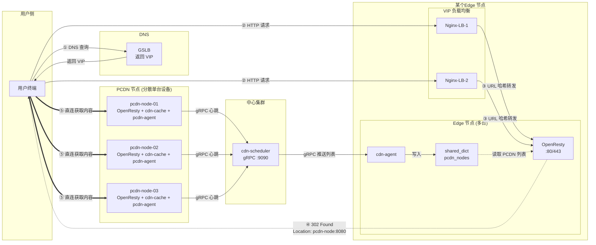
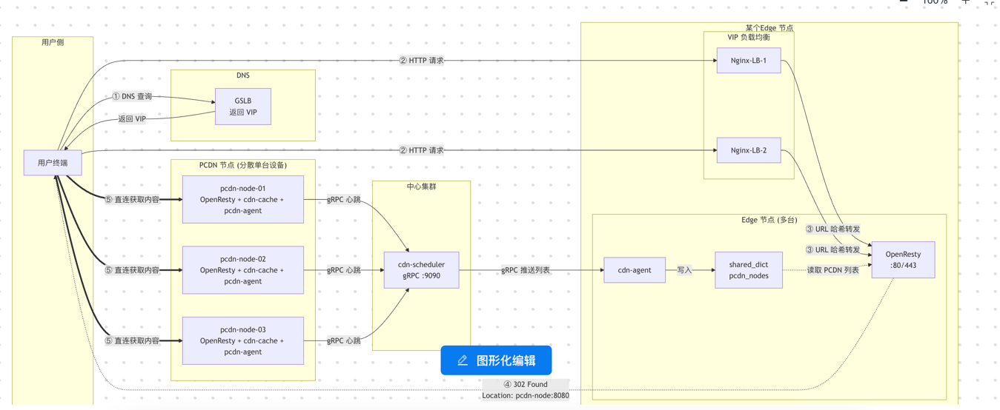

## 12.1 PCDN 系统架构总览图

> 聚焦 PCDN 302 跳转流程：用户请求经 DNS 解析、VIP 负载均衡到达 Edge 节点，由 OpenResty 判断后返回 302 跳转到 PCDN 节点。

(mermaid可视化)[https://www.processon.com/mermaid]



### 302 跳转核心流程

```
① 用户 DNS 查询 → GSLB 返回 VIP 地址
                    ↓
② 用户 HTTP 请求 → VIP (Nginx-LB-1 / LB-2 负载均衡)
                    ↓
③ Nginx-LB 按 URL 哈希 → 转发到某台 Edge 节点 (OpenResty)
                    ↓
④ OpenResty 读取 shared_dict 中的 PCDN 列表
   判断 PCDN 规则 → 返回 302 + Location: http://pcdn-node:8080/...
                    ↓
⑤ 用户浏览器自动跳转 → 直连 PCDN 节点获取内容
```

---

## 12.2 代码模块清单

> 项目包含 7 个 Go 二进制模块和 OpenResty 网关。

### 12.2.1 cdn-cache（缓存服务）

- **二进制名**: `cdn-cache`
- **部署位置**: 边缘节点 / PCDN 节点
- **端口**: 8080
- **通信协议**: HTTP

**核心功能**:
- 接收 OpenResty 转发的 HTTP 缓存请求
- 缓存索引管理（内存 LRU + BoltDB 持久化）
- 缓存文件存储（多磁盘：SSD 热数据 + HDD 冷数据）
- 缓存命中判断与新鲜度校验（Cache-Control、ETag、Last-Modified）
- 缓存未命中时一致性哈希选择 Parent 节点回源
- Revalidate 校验（If-Modified-Since / If-None-Match）
- 缓存淘汰策略（LRU + TTL + 磁盘水位线）
- PURGE 接口（手动清除缓存）
- Prefetch 接口（预取任务）
- Prometheus 指标暴露

---

### 12.2.2 cdn-agent（节点 Agent）

- **二进制名**: `cdn-agent`
- **部署位置**: 边缘节点
- **端口**: 无（后台服务）
- **通信协议**: HTTP / Redis

**核心功能**:
- 定时从 cdn-admin 拉取域名配置和 SSL 证书（HTTP，5s 轮询）
- 定时从 Edge 集群 Redis 读取 PCDN 节点列表（5s 轮询）
- 将配置和 PCDN 列表写入 OpenResty 的 `lua_shared_dict`（热加载）
- 配置版本比对，仅在版本变更时更新
- 接收并执行刷新（PURGE）任务，调用本地 cdn-cache
- 接收并执行预取（Prefetch）任务
- 采集本机 CPU、内存、磁盘、带宽等指标
- 上报节点健康状态

---

### 12.2.3 pcdn-agent（PCDN Agent）

- **二进制名**: `pcdn-agent`
- **部署位置**: PCDN 节点（分散单台设备）
- **端口**: 无（后台服务）
- **通信协议**: gRPC

**核心功能**:
- 定时向省级 pcdn-scheduler 上报心跳（gRPC，5s）
- 上报数据：节点 IP、打洞端口、带宽使用/总量、QPS 当前/最大、连接数
- 采集本机系统指标（CPU、内存、磁盘、网络）
- 检测本地 cdn-cache 健康状态
- 异常时标记节点为不健康，由调度中心剔除

---

### 12.2.4 pcdn-scheduler（省级 PCDN 调度）

- **二进制名**: `pcdn-scheduler`
- **部署位置**: 省份调度中心
- **端口**: 9090
- **通信协议**: gRPC

**核心功能**:
- 接收省内所有 PCDN 节点的 gRPC 心跳上报
- 维护省内 PCDN 节点状态表（在线/离线/健康）
- 心跳超时检测，超时节点标记为离线
- 计算省内各节点的 WRR 权重（带宽×0.6 + QPS×0.4）
- 定时向中心 cdn-scheduler 汇聚上报省份数据（gRPC，10s）
- 汇聚数据：省份标识、节点数量、总可用带宽、总可用 QPS、节点列表

---

### 12.2.5 cdn-admin（管理后台）

- **二进制名**: `cdn-admin`
- **部署位置**: 中心集群
- **端口**: 8081
- **通信协议**: HTTP API

**核心功能**:
- 域名配置管理（CRUD）：回源地址、缓存策略、PCDN 跑量比例、鉴权配置
- SSL 证书管理（CRUD）：证书上传、更新、版本控制
- 边缘节点管理：节点注册、健康状态、上下线
- PCDN 节点管理：查看节点状态、手动上下线
- 配置版本控制：版本号递增、灰度发布
- 刷新任务下发：PURGE 任务分发到各边缘节点
- 预取任务下发：Prefetch 任务分发
- 提供 API 供 cdn-agent 拉取配置（GET /api/config）
- 依赖存储：MySQL（元数据）、Redis（版本号、分布式锁）

---

### 12.2.6 cdn-scheduler（中心调度）

- **二进制名**: `cdn-scheduler`
- **部署位置**: 中心集群
- **端口**: 9090
- **通信协议**: gRPC / Redis

**核心功能**:
- 接收各省 pcdn-scheduler 的 gRPC 汇聚上报
- 维护全局 PCDN 节点状态表
- 计算全局 WRR 权重，生成 PCDN 节点列表
- 定时推送 PCDN 列表到各 Edge 集群的 Redis
- 支持增量推送（仅推送变更节点）
- PCDN 节点分组管理（按省份、运营商）
- 提供 PCDN 节点查询接口
- 依赖存储：Redis（可选，状态缓存）

---

### 12.2.7 cdn-log-processor（日志处理）

- **二进制名**: `cdn-log-processor`
- **部署位置**: 中心集群
- **端口**: 无（后台服务）
- **通信协议**: Kafka Consumer

**核心功能**:
- 消费 Kafka `cdn-access-logs` Topic
- 日志解析和清洗
- 实时统计：QPS、带宽、缓存命中率
- 异常检测：突发流量、源站异常、错误率突增
- 写入 Elasticsearch（全文检索、日志查询）
- 写入 ClickHouse（多维 OLAP 分析）
- 聚合指标上报 Prometheus
- 依赖存储：Kafka、Elasticsearch、ClickHouse

---

### 12.2.8 OpenResty（七层网关）

- **部署位置**: 边缘节点 / PCDN 节点
- **端口**: 80（HTTP）/ 443（HTTPS）
- **通信协议**: HTTP / HTTPS

**核心功能**:
- TLS 卸载，SNI 动态证书加载（ssl_certificate_by_lua）
- 请求路由，根据域名分发到不同配置
- ACL 访问控制（IP 黑白名单、Referer 校验）
- 鉴权校验（URL 签名、时间戳校验）
- **302 跳转判断**（access_by_lua）：
  - 从 `lua_shared_dict` 读取 PCDN 规则和节点列表
  - 检查是否匹配 PCDN 跑量规则（path、域名、比例）
  - WRR 轮询选择 PCDN 节点
  - 返回 302 Found + Location
- 反向代理到 cdn-cache（proxy_pass :8080）
- 响应头处理（header_filter_by_lua）
- 访问日志记录（log_by_lua），输出到文件供 Filebeat 采集

**Lua 阶段**:
| 阶段 | 功能 |
|-----|------|
| init_by_lua | 加载全局配置 |
| init_worker_by_lua | 启动定时任务 |
| ssl_certificate_by_lua | SNI 动态证书 |
| access_by_lua | ACL、鉴权、302 判断 |
| balancer_by_lua | 选择上游 |
| header_filter_by_lua | 响应头处理 |
| log_by_lua | 日志记录 |

**lua_shared_dict 字典**:
| 字典名 | 大小 | 用途 |
|-------|------|------|
| config_cache | 10m | 域名配置缓存 |
| domain_routes | 5m | 路由表 |
| pcdn_nodes | 5m | PCDN 节点列表 |
| ssl_certs | 20m | SSL 证书缓存 |

---


https://github.com/omalloc/tavern.git