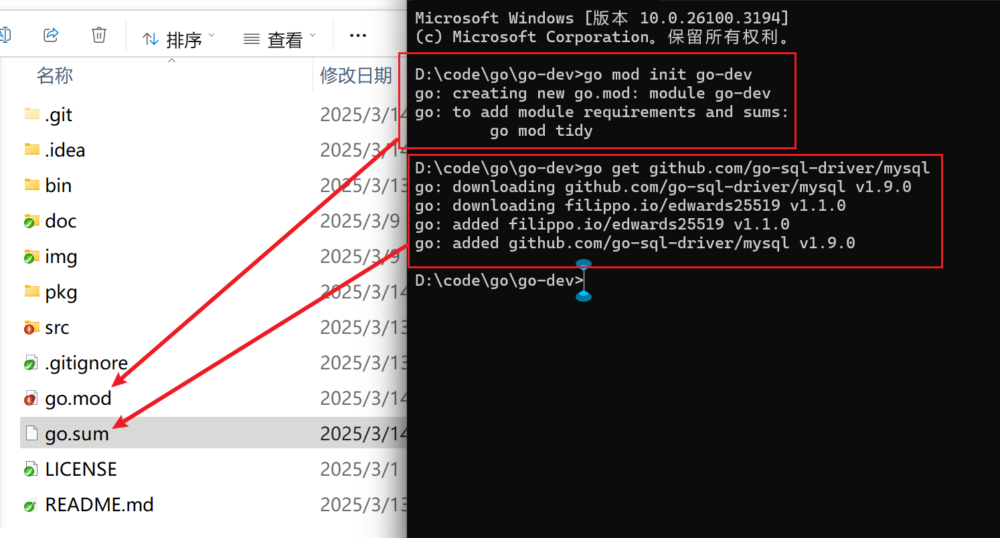

https://juejin.cn/post/7247518785834041403
https://www.cnblogs.com/yinzhengjie/p/18302301

https://www.cnblogs.com/pass-ion/p/16527005.html
https://blog.csdn.net/qq_58281352/article/details/138917235

https://denganliang.github.io/the-way-to-go_ZH_CN/directory.html，第 9 章：包 (package)

# 二.go module介绍
## 1.GO111MODULE环境变量
这个环境变量是"Go Modules"的开关，主要有以下参数：
auto:
    只在项目包含了go.mod文件时启动go modules，在Go1.13版本中是默认值。
on:
    无脑启动Go Modules，推荐设置，Go1.14版本以后的默认值。
off:
    禁用Go Modules，一般没有使用go modules的工程使用。

我现在使用的Go版本是1.22.4，默认GO111MODULE=on。


## 2.GOPROXY


## 


# 包的定义
在Go语言中，包是一个或多个源码文件的集合，源码文件以.go为后缀，在源码文件中，我们可以声明常量、变量、函数、自定义类型与方法。

我们开发的程序(项目或者类库)是由一个或多个包构成的。

# 包的声明
对于Go初学者来说，直接学习Go module这种包管理工具就可以了，为了后面更好地讲解，我们先用go mod init命令初始化一个项目：

module（mod）
## 创建一个module块，即go.mod文件
在项目根目录下执行：go-dev一般就是项目的名称
```
go mod init go-dev
```

## 下载外部包模块
通过`go get`命令下载，以下假设下载mysql数据库驱动
```
go get github.com/go-sql-driver/mysql
```
执行后，会生成go.sum文件，这个文件记录着当前项目每个依赖包的哈希值，在项目构建时，会计算依赖包的哈希值，并与go.sum中对应的哈希值比较，以防止依赖包被窜改。

执行go get命令后，go.mod文件也会新增了一条依赖记录：


go.mod文件内容
```
module go-dev

go 1.24.0

require (
	filippo.io/edwards25519 v1.1.0 // indirect
	github.com/go-sql-driver/mysql v1.9.0 // indirect
)
```
go.sum内容
```
filippo.io/edwards25519 v1.1.0 h1:FNf4tywRC1HmFuKW5xopWpigGjJKiJSV0Cqo0cJWDaA=
filippo.io/edwards25519 v1.1.0/go.mod h1:BxyFTGdWcka3PhytdK4V28tE5sGfRvvvRV7EaN4VDT4=
github.com/go-sql-driver/mysql v1.9.0 h1:Y0zIbQXhQKmQgTp44Y1dp3wTXcn804QoTptLZT1vtvo=
github.com/go-sql-driver/mysql v1.9.0/go.mod h1:pDetrLJeA3oMujJuvXc8RJoasr589B6A9fwzD3QMrqw=
```

## 包安装
通过`go install`命令下载，
```go
go install github.com/go-sql-driver/mysql
go install go-dev/src/test5_test/test57_package/user
```

## main包
Go语言程序的入口main函数，该函数所在的包必须为main:
```go
package main

func main(){
    //...
}
```

# 包的声明
包的声明位于源文件的第一行的package语句，后面跟着包名：
```go
package 包名
```
除了main包外，其他包的名称必须与对应的目录同名，同一个目录下所有源码文件包名必须相同，如当前go文件目录为：`/src/test5_test/test57_package/user/user.go`，那么user.go的包声明为
```go
package user
type User struct {
    ID   int
    Name string
}

```


# 包的导入与使用
包声明之后，就可以在其他包中导入了，导入包名使用import语句。

## 导入路径
标准库包的导入路径一般就是标准库的名称：
```
import "fmt"
import "time"
import "net/http"
```
如果是我们自己声明的包，其导入路径为module路径加上包名，比如我们项目module路径为go-dev/src/test5_test/test57_package/user，那么要导入user包，
注意：go-dev是go mod 那一步创建的模块
```go
import (
    "go-dev/src/test5_test/test57_package/user"
)
```
详细使用实例
```go
package main

import (
	"fmt"
	"go-dev/src/test5_test/test57_package/user"
)

func main() {

	user1 := &user.User{}
	fmt.Println(user1)
	user1.ID = 666
	user1.Name = "张三"
	fmt.Println(user1)

}
```


# 两种导入方式
Go的包有两种导入方式，一种是标准导入，一种是匿名导入
## 标准导入
普通导入在关键字import后跟着导入路径即可，然后就可以通过包名调用包下的变量、函数、常量了：
```go
package main

import (
	"fmt"
	"go-dev/src/test5_test/test57_package/user"
)

func main() {

	user1 := &user.User{}
	fmt.Println(user1)
	user1.ID = 666
	user1.Name = "张三"
	fmt.Println(user1)

}
```

Go支持在导入的时候为包取一个别名(alias)，这样可以避免因包名相同而无法导入的问题，比如下面我们声明一个名称为time的包：
```go
package main

import (
	"fmt"
	myUser "go-dev/src/test5_test/test57_package/user"
)

func main() {

	user1 := &user.User{}
	fmt.Println(user1)
	user1.ID = 666
	user1.Name = "张三"
	fmt.Println(user1)

}
```

如果别名是一个点号，那么此时导入的所有变量、函数、常量都不需要通过包名来访问了：
```go
package main

import (
	"fmt"
	. "go-dev/src/test5_test/test57_package/user"
)

func main() {

	user1 := &user.User{}
	fmt.Println(user1)
	user1.ID = 666
	user1.Name = "张三"
	fmt.Println(user1)

}
```
通过import语句导入的包后必须使用，否则无法通过编译。

但有时候我们导入包仅仅只是为了导入时自动执行包中的init函数而已，在后续代码中并不会使用该包，此时可以通过在包路径前面加上空白符_将导入声明为匿名导入：

```go
package main

import (
	"fmt"
	_ "go-dev/src/test5_test/test57_package/user"
)

func main() {

	user1 := &user.User{}
	fmt.Println(user1)
	user1.ID = 666
	user1.Name = "张三"
	fmt.Println(user1)

}
```


## 可见性
对于定义在包里的变量、常量、函数等代码，如果不想被其他包调用，则其首字母应该设置为小写，小写字母开头的函数、变量、常量为可见性为private，而首字母大写的话，可见性为public，在其他包中被调用：
```go
package user

// 第一个字母小写，默认为内部使用的方法
//private，eat仅在user模块中可以使用
func eat(){
    //....
}

// 第一个字母是大写的默认为外部可以访问的方法
//public，Say可以给外部使用user模块的地方使用
func Say(){
    //....
}
```


## 内部包
我们开发的库可能会分享(比如通过Github或者Gitlab)给其他开发者使用，当我们改动到其他开发者依赖的函数或变量时，就会对他们造成影响，破坏到他们的代码，因此在开发时，要对外暴露通用的，不经常改动的代码，对于会变动的逻辑，可以放在internal目录中，Go语言不允许导入internal包。
比如下面的目录中，internal包中所有的代码，只能在本项目中使用，其他开发者无法导入：
```go
├── cmd
│    └── main.go
├── go.mod
├── go.sum
├── internal
│    └── util
│         └── util.go
├── time
│    └── time.go
└── user
      ├── list.go
      └── user.go
```

# 小结
是Go语言代码的组织单位，通过包，我们可以管理我们的代码，尤其是当开发大型项目时，可以通过包进行模块划分，另外，我们也可以封装自己的包以供其他开发者使用，或者在自己的项目中导入其他开发者的包。

最后，总结一下在这篇文章中的要点：
    Go包管理的历史
    包的声明，对go.mod和go.sum文件有清楚的认识。
    包的导入，包括导入路径，导入方式，可见性以及内部包。


# 其他学习
https://medium.com/rungo/everything-you-need-to-know-about-packages-in-go-b8bac62b74cc
https://learnku.com/go/t/27649

