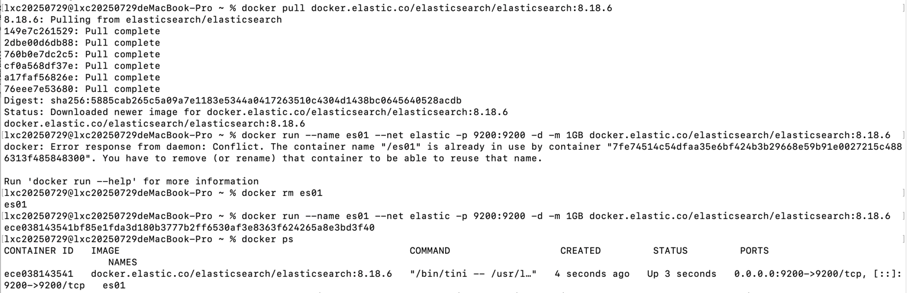

# 安装 es
1. [文件安装](https://www.elastic.co/downloads/elasticsearch)
2. [docker安装](https://www.elastic.co/docs/deploy-manage/deploy/self-managed/install-elasticsearch-with-docker)，安装步骤: `https://www.elastic.co/docs/deploy-manage/deploy/self-managed/install-elasticsearch-docker-basic`
   1. 创建es专用网络：`docker network create elastic`
   2. 拉取镜像：`docker pull docker.elastic.co/elasticsearch/elasticsearch:8.4.1`，镜像地址: `https://www.docker.elastic.co/r/elasticsearch?limit=50&offset=100&show_snapshots=false`
   3. 启动容器：`docker run --name es01 --net elastic -p 9200:9200 -d -m 1GB docker.elastic.co/elasticsearch/elasticsearch:8.4.1`
   4. 导出登陆凭证：`docker exec -it es01 /usr/share/elasticsearch/bin/elasticsearch-reset-password -u elastic`, `docker exec -it es01 /usr/share/elasticsearch/bin/elasticsearch-create-enrollment-token -s kibana`
   5. 导出CA证书：`docker cp es01:/usr/share/elasticsearch/config/certs/http_ca.crt .`
   6. 安装中文分词器：`docker exec -it es01 /bin/bash`, `bin/elasticsearch-plugin install https://get.infini.cloud/elasticsearch/analysis-ik/8.4.1`
      
      

用户名是：elastic，密码是：图中生成的

[go 连接 es](test01_test.go)

# 操作 es

[官方教程](https://www.elastic.co/docs/reference/elasticsearch/clients/go/getting-started)

[go官方api文档](https://pkg.go.dev/github.com/elastic/go-elasticsearch/v8)

https://www.liwenzhou.com/posts/Go/go-elasticsearch/

