# 了解kubectl

Kubernetes 的工作方式是：
👉 它调度 容器镜像（container image），而不是直接运行你本地的 Go 程序。

就像你在本机用 docker run 一样，K8s 里面的 Pod 也是通过拉取一个镜像，然后启动容器来运行的。

所以无论你是 Gin、Spring Boot、Flask，必须把代码封装进镜像，K8s 才能管理它。


# 安装kubectl

## mac下载docker

1. [下载链接](https://www.docker.com/products/docker-desktop/)
2. 验证下载是否成功：```docker version```


## 安装minikube集群工具
[官方连接](https://minikube.sigs.k8s.io/docs/start/?arch=%2Fmacos%2Farm64%2Fstable%2Fhomebrew)

1. 下载：```brew install minikube```
2. 启动(注意：此时docker要处于运行状态)：```minikube start```

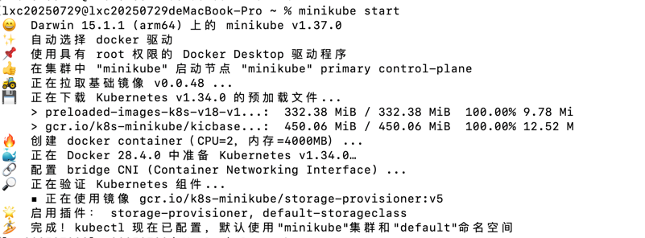


## mac安装kubectl
[官网步骤](https://kubernetes.io/zh-cn/docs/tasks/tools/install-kubectl-macos)

1. 使用brew安装 ```brew install kubectl```
2. 验证是否安装成功```kubectl version --client```
3. 验证kubectl配置```kubectl cluster-info```

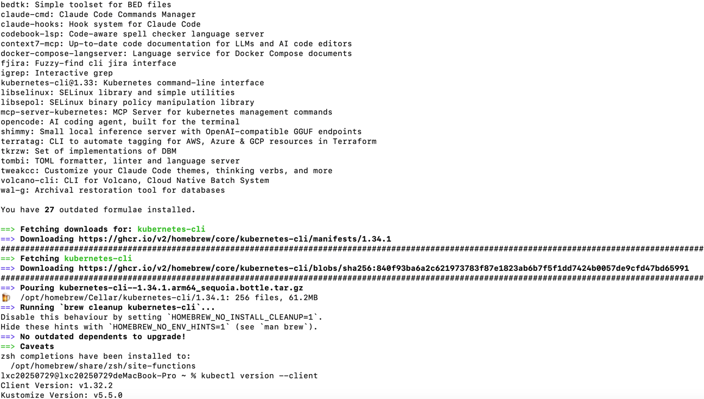
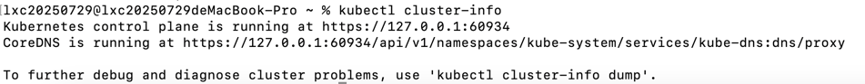

## 检查k8s是否可以使用了

1. ```minikube status```
2. ```kubectl cluster-info```
3. ```kubectl get nodes```
4. ```kubectl get pods -A```

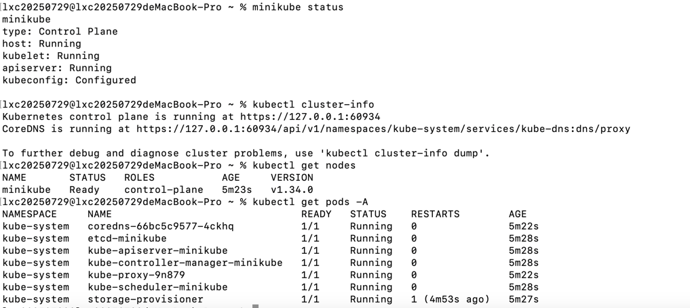

# k8s跑golang应用

## 编写golang代码

详细看[gin_kubectl](https://github.com/nhjclxc/go-dev/tree/main/src/test8_framework/framework_01_web/web_01_gin/gin_02/gin_kubectl)

## 编写Dockerfile
```dockerfile
# 构建阶段
FROM golang:1.22 AS builder

WORKDIR /app
COPY go.mod go.sum ./
RUN go mod download

COPY . .
RUN CGO_ENABLED=0 GOOS=linux go build -o gin_kubectl .

# 运行阶段
FROM alpine:3.20

WORKDIR /app
COPY --from=builder /app/gin_kubectl .
COPY ./config.yaml /app/config.yaml

# 设置时区
RUN apk add --no-cache tzdata \
    && ln -sf /usr/share/zoneinfo/Asia/Shanghai /etc/localtime \
    && echo "Asia/Shanghai" > /etc/timezone

# 给应用添加所有权限
RUN chmod 775 /app/gin_kubectl

EXPOSE 18080 18090 19090

CMD ["/app/gin_kubectl", "-c", "/app/config.yaml"]

```

## 构建镜像

先在gin_kubectl项目跟目录执行`go mod tidy`，之后再执行以下命令来构建镜像
```
docker build -t gin-kubectl:latest .
```
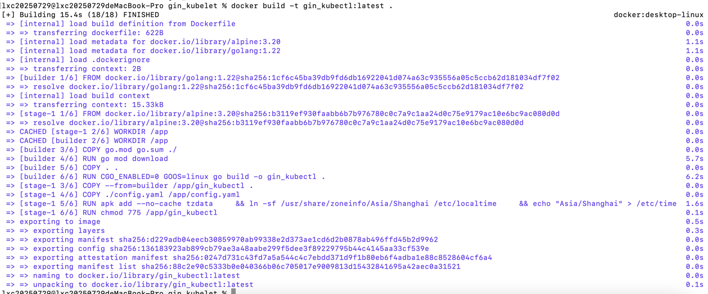

看看docker里面是不是有改镜像了
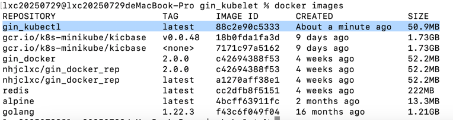

运行看看能不能运行
```
docker run -p 18080:18080 gin-kubectl:latest
```
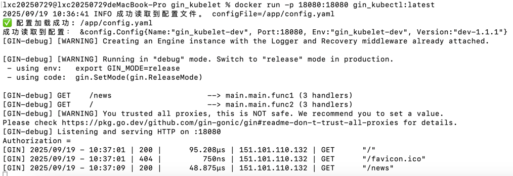

## 把镜像交给 minikube
minikube 里的 k8s 和你本地 docker 不是同一个环境，需要导入镜像。

1. 直接把镜像加载到 minikube```minikube image load gin-kubectl:latest```
2. 切换到 minikube 的 Docker 环境 ```eval $(minikube -p minikube docker-env)```
3. 查看镜像```docker images```
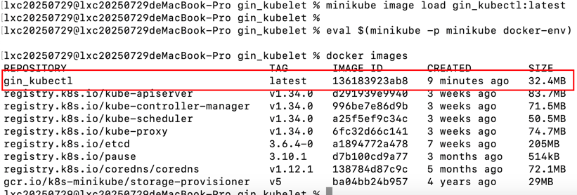

## 编写 Kubernetes 部署文件
新建 deployment.yaml：
```yaml
apiVersion: apps/v1
kind: Deployment # 资源类型为 Deployment，用于管理 Pod 副本、自动滚动更新、回滚等
metadata:
  name: gin-kubectl-deployment # 元数据名称 
spec:
  replicas: 1 # 指定要启动的 Pod 副本数，这里只启动 1 个 Pod。
  selector:
    matchLabels:
      app: gin-kubectl # Deployment 用来匹配 Pod 的标签（label），只有符合 app=gin_kubectl 的 Pod 才归这个 Deployment 管理。
  template:
    metadata:
      labels:
        app: gin-kubectl # Pod 模板的标签，必须和 selector 对应。Deployment 会创建这些 Pod，并自动给它们打上这个标签。
    spec:
      containers: # Pod 内的容器列表，这里只有一个容器。
        - name: gin-kubectl # name：容器名字
          image: gin-kubectl:latest # image：要运行的镜像，这里是你构建的 gin-kubectl:latest
          imagePullPolicy: IfNotPresent # 镜像拉取策略：IfNotPresent：如果本地已有镜像就不用拉；Always：每次都拉最新；Never：完全不拉，只用本地镜像
          ports:
            - containerPort: 18080 # 容器内部监听的端口，这里 Gin 项目监听 18080。
---
apiVersion: v1
kind: Service # 资源类型是 Service，用于给 Pod 暴露网络接口（内部或外部访问）。
metadata:
  name: gin-kubectl-service # Service 的名字，在 kubectl get svc 中显示。
spec:
  type: NodePort # Service 类型：ClusterIP（默认）：只在集群内部访问；NodePort：暴露到节点端口，可以外部访问；LoadBalancer：配合云服务，外部负载均衡访问
  selector:
    app: gin-kubectl # Service 选中哪一组 Pod，通过标签匹配，这里选中 app=gin_kubectl 的 Pod。
  ports:
    - port: 18080 # Service 内部访问的端口（集群内）
      targetPort: 18080 # targetPort：Pod 内容器监听的端口
      nodePort: 30080 # nodePort：节点暴露的端口，外部可以通过 NodeIP:30080 访问 Gin 服务
```
🔹 总结
1. Deployment：负责创建和管理 Pod
2. Service：负责把 Pod 暴露出去，让外部可以访问
3. 标签 selector：Deployment 和 Service 都靠这个标签关联 Pod
4. NodePort：让你在 minikube 或宿主机直接访问 Gin
5. 注意deployment.yaml文件里面不能使用_，可以将其改为-

应用到集群
```kubectl apply -f deployment.yaml```
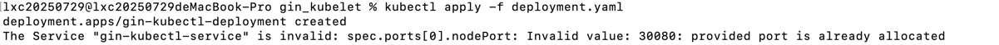


## 验证服务是否可访问

先确认 Pod 正常：

```bash
kubectl get pods
```

`STATUS` 要是 `Running`。

然后确认服务：

```bash
kubectl get svc gin-kubectl-service
```

用 minikube 获取访问地址：

```bash
minikube service gin-kubectl-service --url
```

或者直接访问：

```
http://<minikube_ip>:30080
```

获取 `minikube ip`：

```bash
minikube ip
```

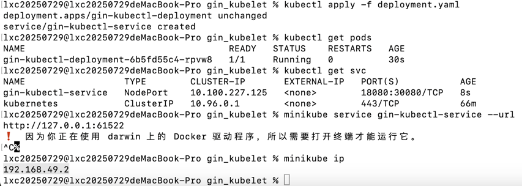
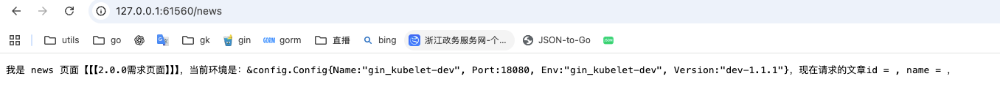


删除一个Service```kubectl delete svc gin-kubectl-service```
删除一个pod```kubectl delete pod gin-kubectl-deployment-6b5fd55c4-6xm54```