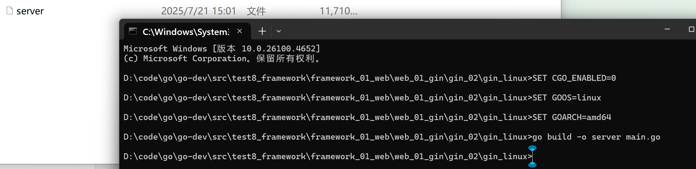
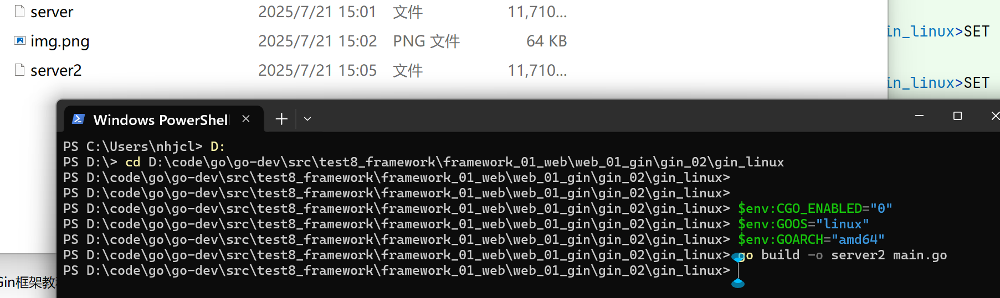

# 一、在 CMD 下面

```bash
SET CGO_ENABLED=0
SET GOOS=linux
SET GOARCH=amd64
go build -o server main.go
```

```bash
D:\code\go\go-dev\src\test8_framework\framework_01_web\web_01_gin\gin_02\gin_linux>SET CGO_ENABLED=0

D:\code\go\go-dev\src\test8_framework\framework_01_web\web_01_gin\gin_02\gin_linux>SET GOOS=linux

D:\code\go\go-dev\src\test8_framework\framework_01_web\web_01_gin\gin_02\gin_linux>SET GOARCH=amd64

D:\code\go\go-dev\src\test8_framework\framework_01_web\web_01_gin\gin_02\gin_linux>go build -o server main.go

D:\code\go\go-dev\src\test8_framework\framework_01_web\web_01_gin\gin_02\gin_linux>
```




# 二、在 PowerShell 下面


```bash
$env:CGO_ENABLED="0"
$env:GOOS="linux"
$env:GOARCH="amd64"
go build -o server2 main.go
```
```bash
PS C:\Users\nhjcl> D:
PS D:\> cd D:\code\go\go-dev\src\test8_framework\framework_01_web\web_01_gin\gin_02\gin_linux
PS D:\code\go\go-dev\src\test8_framework\framework_01_web\web_01_gin\gin_02\gin_linux>
PS D:\code\go\go-dev\src\test8_framework\framework_01_web\web_01_gin\gin_02\gin_linux>
PS D:\code\go\go-dev\src\test8_framework\framework_01_web\web_01_gin\gin_02\gin_linux> $env:CGO_ENABLED="0"
PS D:\code\go\go-dev\src\test8_framework\framework_01_web\web_01_gin\gin_02\gin_linux> $env:GOOS="linux"
PS D:\code\go\go-dev\src\test8_framework\framework_01_web\web_01_gin\gin_02\gin_linux> $env:GOARCH="amd64"
PS D:\code\go\go-dev\src\test8_framework\framework_01_web\web_01_gin\gin_02\gin_linux> go build -o server2 main.go
PS D:\code\go\go-dev\src\test8_framework\framework_01_web\web_01_gin\gin_02\gin_linux>
```

