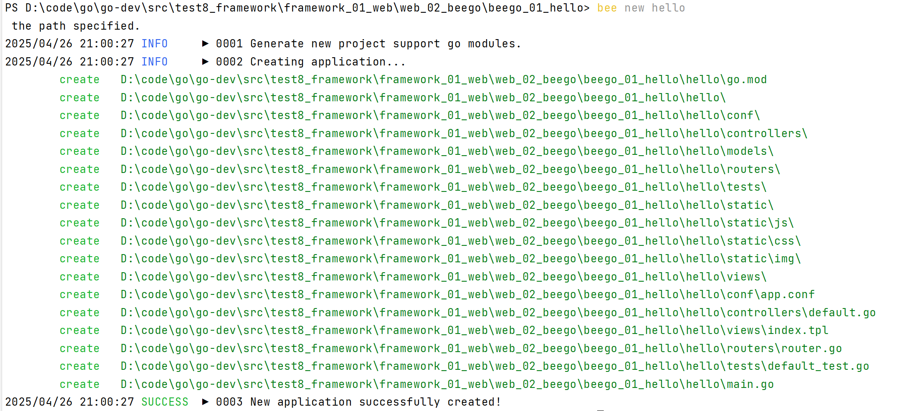
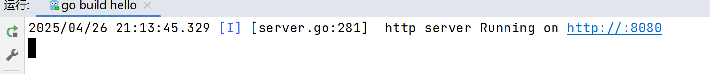
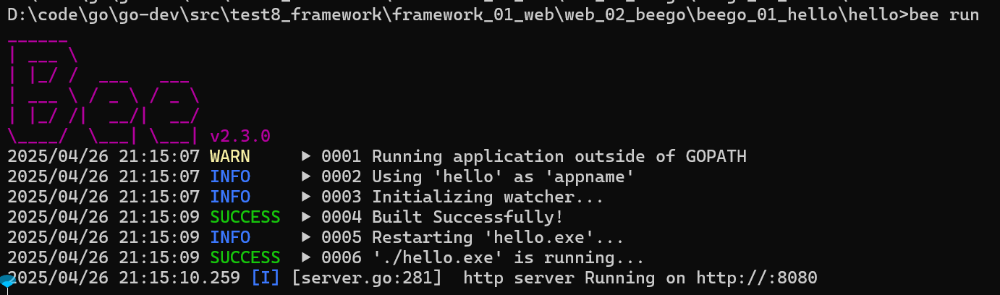
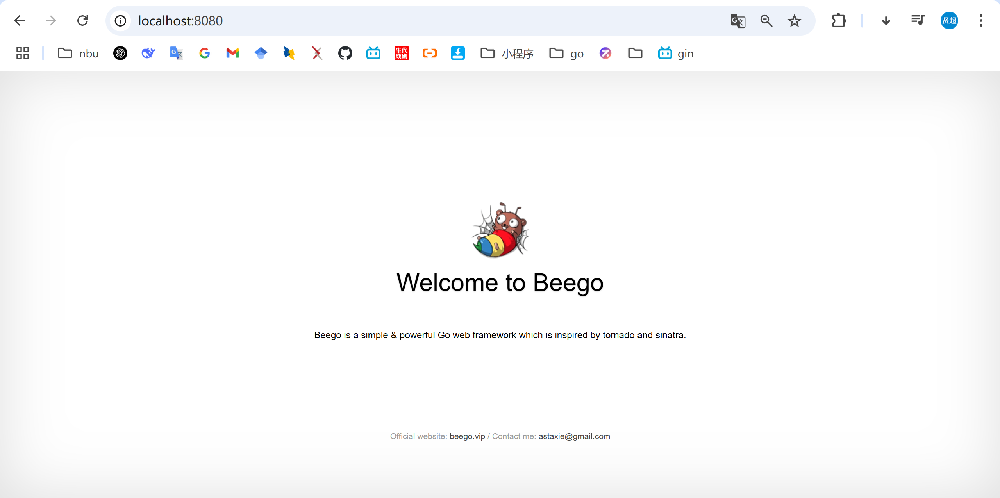
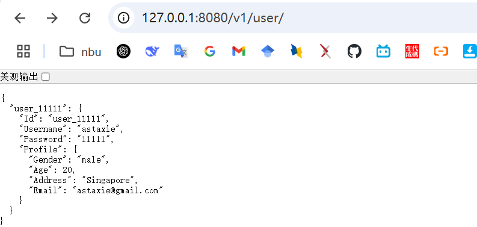
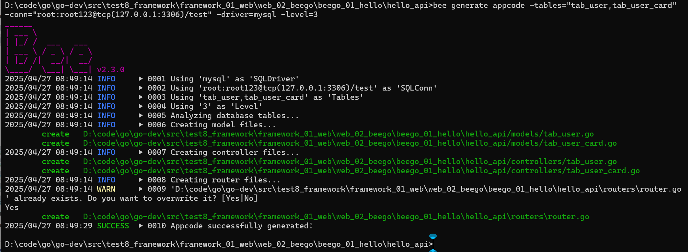

详细步骤查看[beego官方快速开始步骤](https://github.com/beego/beego)
### 快速开始第一个 Beego-web 项目
1. 安装 beego 框架：`go get github.com/beego/beego/v2@latest`
2. 安装 bee 工具：`go install github.com/beego/bee/v2@latest`，之后在 `GOPATH/bin` 目录下会生成一个 `bee.exe` 的beego工具
3. 将 bee.exe 复制到本目录下，cmd 进入本目录下，执行 `bee new hello`，其中 “hello” 就是快速入门的一个项目名称，执行结果如所示
4. 经过第三步就在本目录下生成了一个，cmd 进入 hello文件夹，下载初始化的beego项目所依赖的所有包：`go mod tidy`
5. 执行 main.go 启动项目，启动后效果如图
5. 也可以使用 bee 命令启动，cmd 在 hello 文件夹上面执行 `bee run`（GOROOT/bin须在系统path中，或把bee.exe复制到本目录里面），启动后效果如图
6. 访问 `http://localhost:8080/`， 出现如下效果
7. 生成接口路由：`bee generate routers`
8. 访问接口：http://127.0.0.1:8080/v1/user/， 如下

注意：
 - `bee new hello` 创建的是一个web应用，如果只创建一个 API 应用（纯后端），则使用`bee api hello`创建，如[hello_api](hello_api)，详细看[API命令](https://beegodoc.com/zh/developing/bee/#api-%E5%91%BD%E4%BB%A4)
 - `bee` 命令通过 [fsnotify](https://github.com/howeyc/fsnotify) 监控文件系统，实现了热加载功能，所以使用beego框架就不要用 `go run`命令了
 - 

### 之后快速创建一个项目的三个命令
1. 创建项目：`bee api project_name`
2. 更新包：`go mod tidy`（需进入project_name目录）
3. 生成接口路由：`bee generate routers`
4. 运行项目：`bee run`（需进入project_name目录）


### 更多 bee 相关的命令


请看[bee-工具命令详解](https://beegodoc.com/zh/developing/bee/#bee-%E5%B7%A5%E5%85%B7%E5%91%BD%E4%BB%A4%E8%AF%A6%E8%A7%A3)


#### bee generate 命令

https://beegodoc.com/zh/developing/bee/#generate-%E5%91%BD%E4%BB%A4


好的，来详细讲讲 `bee generate` 命令！🐝

---

首先，`bee` 是 Go 语言中 Beego 框架提供的一个开发辅助工具，`bee generate` 是它里面非常重要的一条命令，用来**自动生成代码**，帮助你快速开发，比如自动生成 model、controller、router 等。

基本格式是：

```bash
bee generate [对象类型] [参数]
```

或者简写成：

```bash
bee g [对象类型] [参数]
```

---

### `bee generate` 可以生成哪些东西？

官方支持生成的主要有：

| 类型         | 说明                                                                                   |
|--------------|--------------------------------------------------------------------------------------|
| `appcode`    | 根据数据库表自动生成 model、controller、router（常用于快速开发 CRUD 应用）               |
| `docs`       | 根据 Beego 项目代码自动生成 Swagger 文档                                               |
| `migration`  | 生成数据库迁移文件（可以管理数据库 schema 变更）                                         |
| `model`      | 生成某个表的 model 层代码（可以单独只生成模型）                                             |
| `controller` | 单独生成 controller 层代码                                                             |
| `router`     | 单独生成 router 层代码（配合 controller 使用）                                             |

---


### beego项目创建完成之后为什么要执行一下"bee generate routers"才能访问接口？？？

好问题！我来给你详细解释一下，**为什么 Beego 项目创建好后，需要执行 `bee generate routers` 才能正常访问接口。**

---

# 📚 1. Beego 是怎么管理路由的？

在 Beego 项目里，**路由**（也就是接口地址和 Controller 方法的映射）有两种主要管理方式：

| 方式          | 说明 |
|--------------|-----|
| 手动注册路由   | 自己写代码一行行 `web.Router("/xxx", &Controller{})` 注册 |
| 自动生成路由表 | 通过 Controller 上的注解，自动扫描并生成 `routers/router.go` 文件 |

Beego 鼓励使用 **注解 + 自动生成** 的方式，更快更规范。

---

# 📜 2. 那么 `bee generate routers` 做了什么？

`bee generate routers` 的作用是：

1. **扫描项目里所有 Controller**
2. **读取 Controller 方法上面的 `@router` 注解**
3. **根据注解内容自动生成路由注册代码**
4. 把生成的代码写入到 `routers/router.go` 里

比如你写了这个 Controller 方法：

```go
// @router /anonymous_user/info [get]
func (u *UserController) GetUserInfo() {
    ...
}
```

执行 `bee generate routers` 后，会在 `routers/router.go` 自动生成：

```go
func init() {
    web.Router("/anonymous_user/info", &controllers.UserController{}, "get:GetUserInfo")
}
```

这样程序启动的时候，Beego 才知道  
**请求 `/user/info` 应该走 `UserController` 的 `GetUserInfo` 方法**！

👉 **如果你不执行 `bee generate routers`，Beego 根本不知道你的接口在哪儿，所以访问的时候就404了。**

---

# 🚀 3. 总结一句话

> `bee generate routers` 是为了  
> **根据 Controller 注解自动生成路由注册代码，  
> 让 Beego 知道每个接口地址对应哪个 Controller 方法！**

---

# 📌 补充小知识

| 项目                              | 说明 |
|----------------------------------|-----|
| 每次新增了 Controller 或 @router注解 | 都应该重新执行一次 `bee generate routers` |
| `routers/router.go` 里都是自动生成的 | 手动改的话，下次 `bee generate routers` 会被覆盖掉 |
| 如果不想用自动生成               | 也可以自己在 `router.go` 手动写路由（传统方式） |

---

要不要我顺便再画一张【bee generate routers内部流程图】？  
保证你一眼秒懂 "扫描Controller → 生成代码 → 注册路由" 的流程！要的话告诉我～🌟


### 各个子命令具体用法细讲

---

#### 1. `bee generate appcode`
👉 根据数据库表，生成 model、controller 和 router，适合快速搭建完整的后端接口。

常用格式：

```bash
bee generate appcode -tables="user,order" -conn="root:password@tcp(127.0.0.1:3306)/testdb" -driver=mysql -level=3
```

参数解释：
- `-tables`：指定数据库的表名，多个用逗号隔开
- `-conn`：数据库连接串
- `-driver`：数据库驱动，比如 mysql、postgres
- `-level`：
    - `1`：只生成 model
    - `2`：生成 model + controller
    - `3`：生成 model + controller + router（默认是3）
- `-output`：指定生成的代码放到哪个目录（默认是当前目录）

✅ 举例：
```bash
bee generate appcode -tables="users" -conn="root:123456@tcp(localhost:3306)/mydb" -driver=mysql
```
这会帮你自动生成 `models/users.go`、`controllers/users.go` 和 `routers/users.go`！

---

#### 2. `bee generate docs`
👉 自动根据你的路由、controller 注释，生成 Swagger 文档。

命令：

```bash
bee generate docs
```

要求你的 controller 写了类似这样的注释：

```go
// @router /anonymous_user [get]
func (c *UserController) Get() {}
```

执行完后，会生成一个 `swagger` 目录，里面是可以直接给 Swagger UI 用的 JSON 文件。

---

#### 3. `bee generate migration`
👉 生成数据库迁移文件（类似于 Django、Rails 那种 migration）。

命令：

```bash
bee generate migration create_user_table
```

它会在 `database/migrations` 下生成一个以时间戳开头的 go 文件，比如：

```
20250427121345_create_user_table.go
```

里面有两个方法：
- `Up()`：写创建表的 SQL
- `Down()`：写回滚（删除表）的 SQL

---

#### 4. `bee generate model`
👉 单独生成 model（如果你不想生成 controller/router）。

命令：

```bash
bee generate model -tables="user,order" -conn="root:password@tcp(127.0.0.1:3306)/testdb" -driver=mysql
```

比 `appcode` 更轻量，只关心数据结构，比如生成 `models/user.go`。

---

#### 5. `bee generate controller`
👉 单独生成 controller。

命令：

```bash
bee generate controller User
```

会生成：

```go
package controllers

type UserController struct {
    beego.Controller
}
```

并带一个空的基本方法。

---

#### 6. `bee generate router`
👉 单独生成路由绑定。

命令：

```bash
bee generate router User
```

会生成在 `routers/router.go` 里面的一段：

```go
beego.Router("/anonymous_user", &controllers.UserController{})
```

---

### 总结一下
如果快速开发 API，最常用的是：

- `bee generate appcode` （直接把 model、controller、router 都生成好）
- 然后自己再稍微补充业务逻辑。

如果是做项目管理，比如数据库升级脚本，就用：

- `bee generate migration`

如果要维护 Swagger 文档，就用：

- `bee generate docs`

---

### ⚡小提示
- 使用 `bee` 前一定要确保 `$GOPATH/bin` 在你的 `PATH` 中，不然命令找不到。
- `bee` 依赖的 Beego 项目结构必须规范，比如有 `main.go`、有 `controllers/`、`models/`、`routers/` 这些目录。
- 如果是新版 Beego（beego v2+），要注意和 bee 版本配套，推荐使用 [`bee v2`](https://github.com/beego/bee)。

---

要不要我顺便给你举个实际项目中用 `bee generate appcode` 一次生成 10 个表的例子？🌟  
要的话告诉我～
