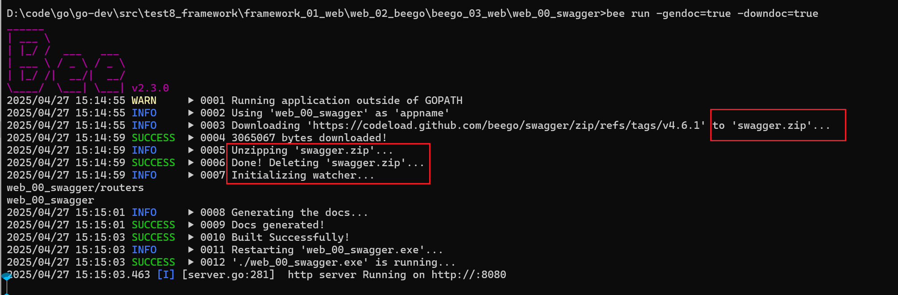

#### [beego和swagger搭配使用 web_00_swagger](web_00_swagger)

启动步骤
1. 创建项目：`bee api web_00_swagger`
2. 进入 `web_00_swagger` 目录
3. 更新包：`go mod tidy`
4. 生成接口路由：`bee generate routers`
5. 第一次启动项目，如果直接使用 `bee run` 运行项目，则没有swagger文档可以访问
6. 第一次运行项目需要执行 `bee run -gendoc=true -downdoc=true`，以生成可以访问的swagger文档（后续可以直接使用`bee run -gendoc=true`运行且可以访问swagger，还是要带` -gendoc=true`的理由是：你在编写代码过程中新增了swagger信息，因此建议每次启动都把生成的这个命令带上），这时会在当前目录下生成一个 swagger 的文件夹，如下图
7. 访问 swagger `http://127.0.0.1:8080/swagger/`。
8. 测试接口是否可以访问，如图

来源：[使用Beego创建API项目并自动化文档](https://blog.csdn.net/witton/article/details/138485767)、[使用Gin编写Web API项目并自动化文档](https://blog.csdn.net/witton/article/details/138493433)、[wiki-swagger](https://beego.wiki/zh-cn/docs/advantage/docs/)

beego代码注释 -> swagger.json(服务说明文档) -> swagger ui(文档和联调的web) -> swagger code generator(生成调用的客户端代码)

