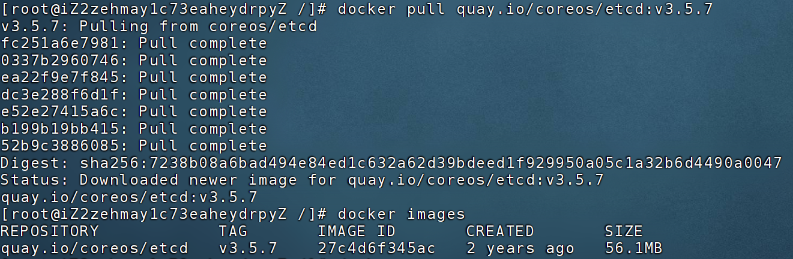
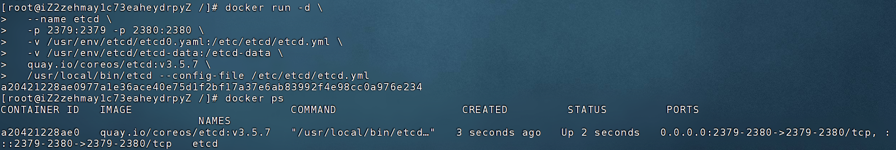
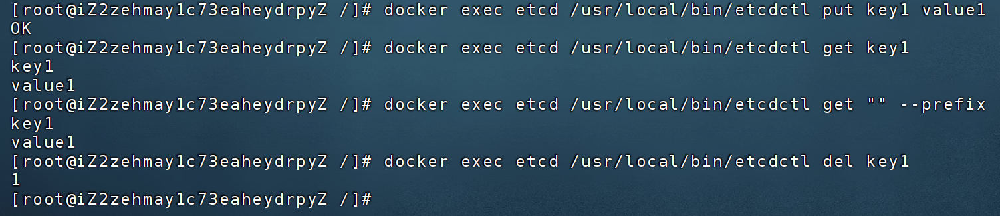

# 安装 ETCD

## Windows 安装 ETCD

https://blog.csdn.net/weixin_48711370/article/details/139195516

## Linux 安装 ETCD

### docker安装

https://blog.csdn.net/2303_77208351/article/details/142924283

1. 下载镜像

```
docker pull quay.io/coreos/etcd:v3.5.7
```


2. 编写etcd配置文件

文件存放位置：/usr/env/etcd/etcd0.yaml

注意：以下出现的ip地址，请替换为实际ip地址
```yaml
 # 当前 etcd 节点的名称，在集群中必须唯一，单节点时随便命名即可
 name: s1

 # etcd 数据存储目录（如键值数据、快照等），需要持久化
 data-dir: /usr/env/etcd/etcd-data

 # 接收客户端（如 etcdctl、应用程序）连接的监听地址
 listen-client-urls: http://0.0.0.0:2379

 # 对外公告的客户端连接地址（其他客户端通过它访问 etcd）
 advertise-client-urls: http://39.106.59.225:2379

 # 集群内部节点之间通信监听的地址（单节点也必须配置）
 listen-peer-urls: http://0.0.0.0:2380

 # 对外公告的 peer 通信地址（即本节点用于集群内部通信的地址）
 initial-advertise-peer-urls: http://39.106.59.225:2380

 # 初始集群节点列表（单节点时只有自己），格式为 name=peer地址
 initial-cluster: s1=http://39.106.59.225:2380

 # 本次 etcd 启动使用的集群 token，多个集群应使用不同的 token 区分
 initial-cluster-token: etcd-cluster-1

 # 集群状态，"new" 表示新建集群；如果加入已有集群应设置为 "existing"
 initial-cluster-state: new

```


3. 启动容器

```shell
docker run -d \
  --name etcd \
  -p 2379:2379 -p 2380:2380 \
  -v /usr/env/etcd/etcd0.yaml:/etc/etcd/etcd.yml \
  -v /usr/env/etcd/etcd-data:/etcd-data \
  quay.io/coreos/etcd:v3.5.7 \
  /usr/local/bin/etcd --config-file /etc/etcd/etcd.yml
```



4. 操作etcd

1.添加一个key
docker exec etcd /usr/local/bin/etcdctl put key1 value1

2.获取一个key-value

docker exec etcd /usr/local/bin/etcdctl get key1

3.获取所有key-value

docker exec etcd /usr/local/bin/etcdctl get "" --prefix

4.删除一个key

docker exec etcd /usr/local/bin/etcdctl del key1

由于etcd集群各节点间数据完全同步，因此，在一个节点上的put操作可以在另一个节点上看到结果，此外，由于leader节点负责写操作，所以在follower节点上的写操作会被重定向到leader节点进行操作

原文链接：https://blog.csdn.net/2303_77208351/article/details/142924283




### yum 安装

https://juejin.cn/post/7254473296611967031

### 安装包 安装


# Etcd 可视化管理工具，GUI 客户端


https://github.com/gtamas/etcdmanager

https://github.com/gtamas/etcdmanager/releases/tag/1.2.0

https://github.com/gohutool/boot4go-etcdv3-browser?tab=readme-ov-file

