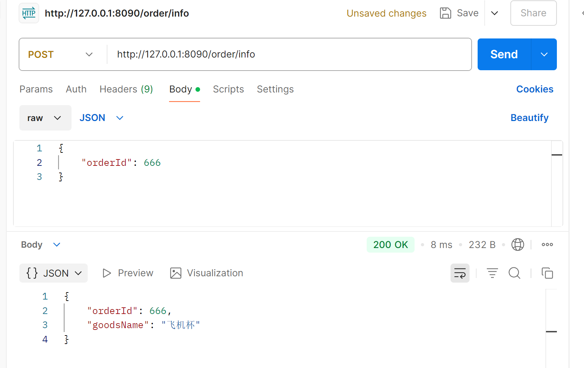
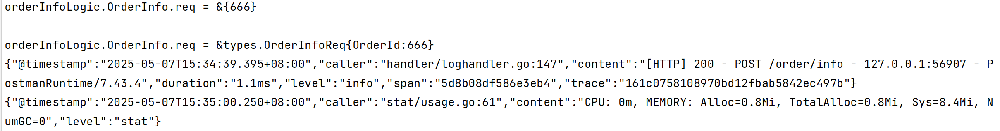

# 快速开始学习教程

[教程链接](https://juejin.cn/post/7225565801791799354)


## 1、api的生成

### 1.1、执行goctl命令

cmd进入*.api所在文件夹，执行：`goctl api go -api order.api -dir ../ --style=goZero`，详细的goctl命令看 [goctl命令](https://go-zero.dev/docs/tasks/cli/api-demo)

[go-zero goctl常用命令简介](https://blog.csdn.net/a6652162/article/details/125393791)

| 参数/选项            | 作用说明                                                                          |
|------------------|-------------------------------------------------------------------------------|
| `goctl`          | go-zero 提供的脚手架工具（Go Code Tool），用于生成各种模块代码，如 API、RPC、模型等。                      |
| `api`            | 指的是对 `.api` 接口描述文件的处理模块。这里表示你要操作 API 项目。                                      |
| `go`             | 指定要生成 Go 语言代码（和 `goctl api java` 之类的区分）。也就是目标语言是 Go。                          |
| `-api order.api` | 指定 API 描述文件（order.api），它定义了 HTTP 接口、路由、请求体、响应体等内容。goctl 会基于它生成接口对应的代码。        |
| `-dir ../`       | 指定代码生成的目标目录，这里是当前目录的上一级目录（`../`）。你也可以指定成比如 `-dir ./order` 来生成到 `order/` 子目录下。 |
| `--style=goZero` | 指定代码风格。goctl 支持不同的风格规范，目前 `goZero` 是 go-zero 推荐的规范风格，代码结构清晰且官方维护。             |


### 1.2、执行命令后，会生成以下结构：

```
zero-order
├── api
│   └── order.api                   # 原始 API 描述文件
├── etc
│   └── order-api.yaml              # 服务配置文件
├── internal
│   ├── config
│   │   └── config.go               # 配置结构体定义
│   ├── handler
│   │   ├── routes.go               # 路由注册（多个 handler 会注册在这里）
│   │   └── orderInfoHandler.go     # 具体的处理函数，每个接口对应一个 handler 文件（如 createorderhandler.go）
│   ├── logic
│   │   └── orderInfoLogic.go       # 每个接口对应的逻辑实现，核心逻辑层（业务）
│   ├── svc
│   │   └── serviceContext.go       # 依赖注入上下文，上下文依赖管理（数据库、服务等）
│   └── types
│       └── types.go                # 请求响应结构体定义
└── order.go                        # 主程序入口，启动 API 服务
```

### 1.3、 🔄 整个工作流理解

1. 编写 `.api` 文件，定义接口与数据结构。
2. 使用 `goctl` 命令生成代码骨架。
3. 在 `logic` 目录中填充业务逻辑。
4. 配置运行参数（如 etc 中的 YAML）。
5. 编译运行 `order.go` 启动服务。


## 2、创建包管理以及包依赖更新

cmd 回到[zero-order](zero-order) 目录，依次执行如下两个命令来创建包管理和更新所用到的包。

`go mod init zero-order` 

`go mod tidy` 


## 3、修改实际配置运行参数


## 4、在 `logic` 目录中填充业务逻辑。

[orderInfoLogic.go](zero-order%2Finternal%2Flogic%2ForderInfoLogic.go)

注意：不要随意的编辑goctl命令生成的 routes.go 和 types.go 文件，如需要修改，请通过修改 *.api文件重新编译重新


## 5、运行 `order.go` 启动服务。


## 6、访问接口

127.0.0.1:8090/order/info





