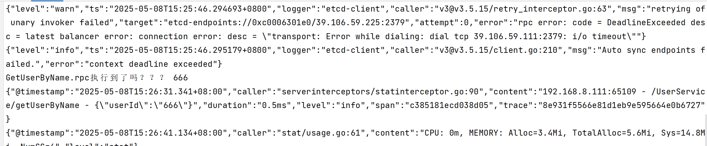
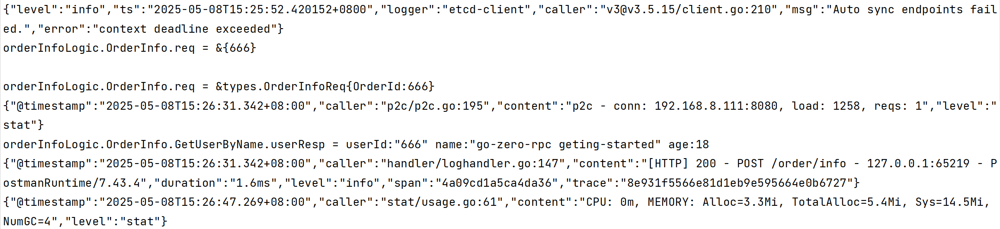
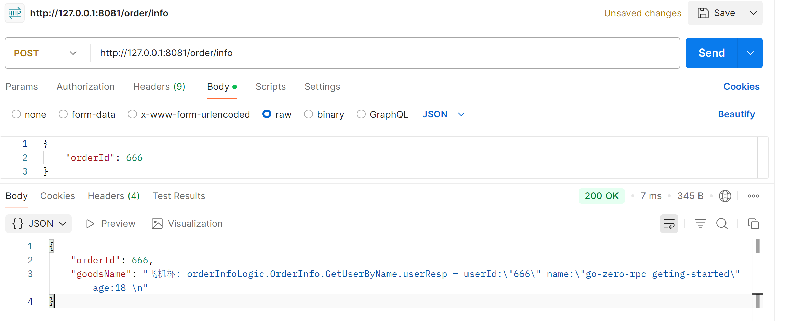

# 一、go-zero RPC微服务调用快速开始学习教程

官方参考示例：
[编写 transform rpc 服务](https://github.com/zeromicro/zero-doc/blob/main/doc/shorturl.md)


# 二、服务提供者 Producer

## 2.1、proto文件的生成

在目录 [proto](user-service%2Fproto) 下，执行 `goctl rpc -o user.proto`，之后根据实际修改 [user.proto](user-service%2Fproto%2Fuser.proto) 文件


## 2.2、根据proto文件生成 rpc 相关代码

在目录 [proto](user-service%2Fproto) 下，执行 `goctl rpc protoc user.proto --go_out=. --go-grpc_out=. --zrpc_out=../`，将文件生成到[proto](user-service%2Fproto)的上一级目录[user-service](user-service)下。


## 2.3、创建包管理以及包依赖更新

cmd 回到 [user-service](user-service) 目录，依次执行如下两个命令来创建包管理和更新所用到的包。

`go mod init user-service`

`go mod tidy`


## 2.3、修改实际配置运行参数


Etcd 是本次的注册中心，

注意：在此之前必须先安装ETCD服务发现，如果还没有安装ETCD，请看[ETCD安装.md](..%2F..%2Fmicro_04_service_discovery%2Fservice_discovery_01_etcd/ETCD安装.md)

```yaml
Name: user-service
ListenOn: 0.0.0.0:8080
Etcd:
  Hosts:
    - 39.106.59.225:2379
  Key: user-service
```

## 2.4、在 `logic` 目录中填充业务逻辑。

[orderInfoLogic.go](zero-order%2Finternal%2Flogic%2ForderInfoLogic.go)


## 2.5、运行 `user.go` 启动服务。


# 三、服务消费者 Consumer


## 3.1、创建一个 API 服务

详细请看[快速开始学习教程.md](../go_zero_01_getting_started/快速开始学习教程.md)


## 3.2、在消费端注册order-service服务

在 [order.yaml](order-service%2Fetc%2Forder.yaml) 添加如下配置。

注意：下面的UserService必须和[config.go](order-service/internal/config/config.go)里面的一样，这样才能对应起来读取配置

```yaml
Name: order-service
Host: 0.0.0.0
Port: 8081

UserService:
  Etcd:
    Hosts:
      - 39.106.59.225:2379
    Key: user-service
```


## 3.3、在消费端注入 UserService 配置

修改 order-service 下的[config.go](order-service/internal/config/config.go)，即将 user-service 写到 order-service里面。

注意：以下的 UserService 必须和 [order.yaml](order-service%2Fetc%2Forder.yaml) 里面的UserService一样，这样才能对应起来读取配置。

```go
package config

import (
	"github.com/zeromicro/go-zero/rest"
	"github.com/zeromicro/go-zero/zrpc"
)

type Config struct {
	rest.RestConf  // 嵌套 rest 配置，用于 HTTP 服务的相关配置
	UserService zrpc.RpcClientConf   // 手动代码
}

```

## 3.4、在消费端注入 UserService 客户端

先将 order-service服务下面 user.proto 生成的 [rpc](user-service%2Fproto%2Frpc) 文件夹和[userservice.go](user-service%2Fuserservice%2Fuserservice.go)复制到 [order-service](order-service) 下面的 [rpc/user](order-service%2Frpc%2Fuser)下面

接着继续编辑 order-service 下的 [serviceContext.go](order-service%2Finternal%2Fsvc%2FserviceContext.go)（这里就要用到user-service生成的代码了）
```go
package svc

import (
	"github.com/zeromicro/go-zero/zrpc"
	"order-service/internal/config"
	rpcUser "order-service/rpc/user"
)

type ServiceContext struct {
	Config config.Config
	UserService rpcUser.UserService                                          // 手动代码
}

func NewServiceContext(c config.Config) *ServiceContext {
	return &ServiceContext{
		Config: c,
		UserService: rpcUser.NewUserService(zrpc.MustNewClient(c.UserService)), // 手动代码
	}
}
```


## 3.5、在 logic 中使用 rpcUser 客户端调用

在 [orderInfoLogic.go](order-service%2Finternal%2Flogic%2ForderInfoLogic.go) 中使用 rpc 服务

```go
package logic

import (
	"context"
	"errors"
	"fmt"

	"order-service/internal/svc"
	"order-service/internal/types"

	rpcUser "order-service/rpc/user"

	"github.com/zeromicro/go-zero/core/logx"
)

type OrderInfoLogic struct {
	logx.Logger
	ctx    context.Context
	svcCtx *svc.ServiceContext
}

// 获取订单信息
func NewOrderInfoLogic(ctx context.Context, svcCtx *svc.ServiceContext) *OrderInfoLogic {
	return &OrderInfoLogic{
		Logger: logx.WithContext(ctx),
		ctx:    ctx,
		svcCtx: svcCtx,
	}
}

func (l *OrderInfoLogic) OrderInfo(req *types.OrderInfoReq) (resp *types.OrderInfoResp, err error) {
	// todo: add your logic here and delete this line
	fmt.Printf("orderInfoLogic.OrderInfo.req = %v \n", req)
	fmt.Println()
	fmt.Printf("orderInfoLogic.OrderInfo.req = %#v \n", req)

	if req.OrderId == 0 {
		err = errors.New("OrderId不能为空！！！")
		return nil, err
	}

	// 调用 rpc
	userReq := rpcUser.UserReq{UserId: "666"}
	userResp, err := l.svcCtx.UserService.GetUserByName(l.ctx, &userReq)
	if err != nil {
		return nil, err
	}
	fmt.Printf("orderInfoLogic.OrderInfo.GetUserByName.userResp = %v \n", userResp)

	resp = &types.OrderInfoResp{
		OrderId: req.OrderId,
		GoodsName: "飞机杯: " + fmt.Sprintf("orderInfoLogic.OrderInfo.GetUserByName.userResp = %v \n", userResp),
	}

	return
}

```


## 3.6、补全依赖

最后 cmd 进入 [order-service](order-service)，执行 `go mod tidy ` 补全依赖


# 四、测试RPC服务是否正常

先启动生产者 user-service 

接着启动消费者 order-service 

curl -X POST http://127.0.0.1:8081/order/info -H "Content-Type: application/json" -d "{\"orderId\":666}"






至此，go-zero的rpc快速开始练习结束
