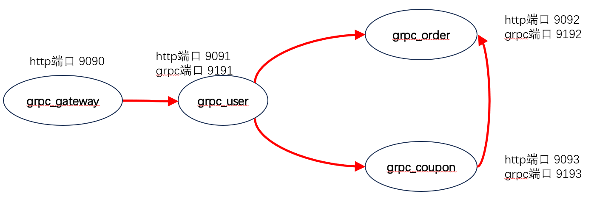

http服务和grpc服务混合使用。

注意：与[go_zero_01_getting_started](..%2Fgo_zero_01_getting_started)和[go_zero_02_getting_started_rpc](..%2Fgo_zero_02_getting_started_rpc)不同，这两个是单独的http或是单独的grpc

# 服务说明
- grpc_user
  - 当http服务时，监听http的9090端口
  - 当grpc服务提供者时，监听tcp的9190端口

- grpc_order
  - 当http服务时，监听http的9091端口
  - 当grpc服务提供者时，监听tcp的9191端口

说明：可以将9090、9091、9092、9093、9094、9095...当成服务的http端口。可以将9190、9191、9192、9193、9194、9195...当成服务对应的grpc端口。

# grpc_user

在[user.go](grpc_user%2Fuser.go)里面要同时注册grpc的服务和http的服务，并且要在httpServer.Start()之前注册grpc服务，此外由于*.Strat()方法都是阻塞的，因此这里必须使用goroutine注册grpc服务

docker exec etcd etcdctl --endpoints=39.106.59.225:2379 get user.rpc --prefix

# grpc_order

docker exec etcd etcdctl --endpoints=39.106.59.225:2379 get order.rpc --prefix

# grpc_coupon

docker exec etcd etcdctl --endpoints=39.106.59.225:2379 get coupon.rpc --prefix

# 微服务之间的关系

# 其他知识

在一个完整的 商城项目（电商系统） 中，除了 user（用户）微服务 和 order（订单）微服务，通常还可以细分出多个核心微服务模块。以下是常见的电商微服务划分建议：

✅ 常见微服务划分（推荐）
| 微服务名称             | 描述                                |
| ----------------- | --------------------------------- |
| `user` 用户服务       | 用户注册、登录、认证、资料、账户安全等。              |
| `order` 订单服务      | 提交订单、订单查询、订单状态流转等。                |
| `product` 商品服务    | 商品列表、详情、分类、上下架、库存展示等。             |
| `inventory` 库存服务  | 商品库存管理、库存扣减、库存回滚等。                |
| `payment` 支付服务    | 支付下单、回调通知、退款等。支持支付宝、微信、余额。        |
| `cart` 购物车服务      | 添加购物车、修改数量、勾选结算等。                 |
| `coupon` 优惠券服务    | 领取优惠券、使用、抵扣等。                     |
| `comment` 评论服务    | 商品评论、晒单、用户评分等。                    |
| `address` 地址服务    | 收货地址的新增、修改、删除、默认设置等。              |
| `message` 消息服务    | 站内信、通知推送、短信服务等。                   |
| `logistics` 物流服务  | 快递发货、物流轨迹查询等。                     |
| `search` 搜索服务     | 商品搜索、关键词联想、过滤器（常用 Elasticsearch）。 |
| `admin` 后台服务      | 商品管理、订单管理、用户管理、系统配置等。             |
| `auth` 授权服务       | JWT 认证、权限控制、token 续期等（也可放入 user）。 |
| `file` 文件服务       | 图片上传、OSS 存储、资源管理等。                |
| `gateway` API 网关  | 请求路由、鉴权、限流、灰度等统一入口。               |
| `monitoring` 监控服务 | 链路追踪、服务健康检测、报警通知等。                |

🔄 模块之间的调用示意
plaintext
复制
编辑
[User]         -> [Auth]
[User]         -> [Address]
[Order]        -> [User], [Cart], [Inventory], [Coupon], [Payment]
[Cart]         -> [Product]
[Product]      -> [Inventory]
[Search]       -> [Product]
[Admin]        -> [Product], [Order], [User], ...
[Payment]      -> 第三方支付
[Message]      -> [User], [Order]

🔧 微服务拆分建议原则
单一职责：每个服务只负责一个核心功能。

高内聚低耦合：服务内部高内聚，跨服务通过接口调用。

可独立部署扩展：一个服务故障不影响其他服务。

按领域驱动设计（DDD） 拆分更清晰。