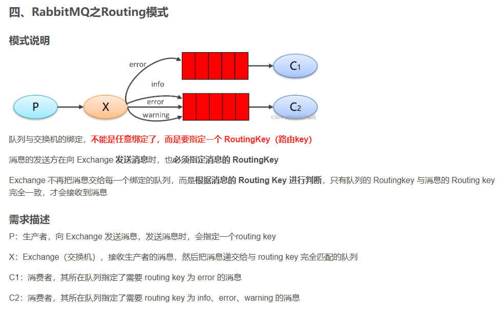

# docker 按照 rabbitmq
```shell
docker pull swr.cn-north-4.myhuaweicloud.com/ddn-k8s/docker.io/rabbitmq:4.1.0-management
 
 docker run -itd --restart=always \
 --name rabbitmq \
 -p 4369:4369 \
 -p 5671:5671 \
 -p 5672:5672 \
 -p 15691:15691 \
 -p 15692:15692 \
 -p 25672:25672 \
 -p 15672:15672 \
 -v /var/lib/rabbitmq:/var/lib/rabbitmq \
 -e RABBITMQ_DEFAULT_USER=admin \
 -e RABBITMQ_DEFAULT_PASS=admin123 \
 swr.cn-north-4.myhuaweicloud.com/ddn-k8s/docker.io/rabbitmq:4.1.0-management
```

访问是否安装成功：http://ip:15672/#/


https://blog.csdn.net/weixin_43715214/article/details/125060541




